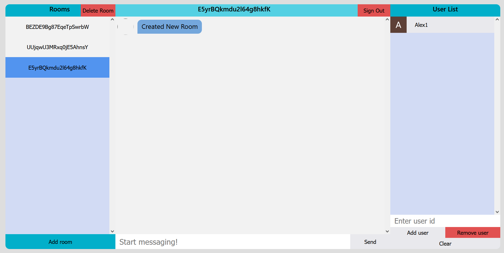

# Chat App

A chat app that supports public and private chat rooms.

# Features

<!--  -->

## Rooms Column (Left)

- Displays the list of rooms you have access to
- The name of the room is the ID of the room
- Click to enter room
- You can create your own private rooms and only delete rooms you have created (more details in the User Column section)

## Center Column (Center)

- Sign out in the top right
- Enter your message and submit your message
- Messages are currently undeletable by the sender
- You can click users avatar to copy their user ID (more details in the User Column section)

## User Column (Right)

- Displays the list of users in the current chat room you are in
- Click the user tile to copy their user ID
- If you are the Admin (creator of the room) you can add or delete users to your room by entering their user ID into the input box then clicking either add or delete
- Clear button - clears the current input in the user ID box

## Other Features And Information
- Getting user ID
    - Clicking their avatar next to their image will copy the ID to your clipboard as well as auto filling the input box
    - Clicking their user tile in the User Column will copy the ID to your clipboard as well as auto filling the input box
- When signing in you can enter a optional Username instead of being named your user ID

## Built With

* [React](https://reactjs.org/) - Frontend framework
* [Firebase](https://firebase.google.com/) - For authentication and the backend database

## Authors

- Me
